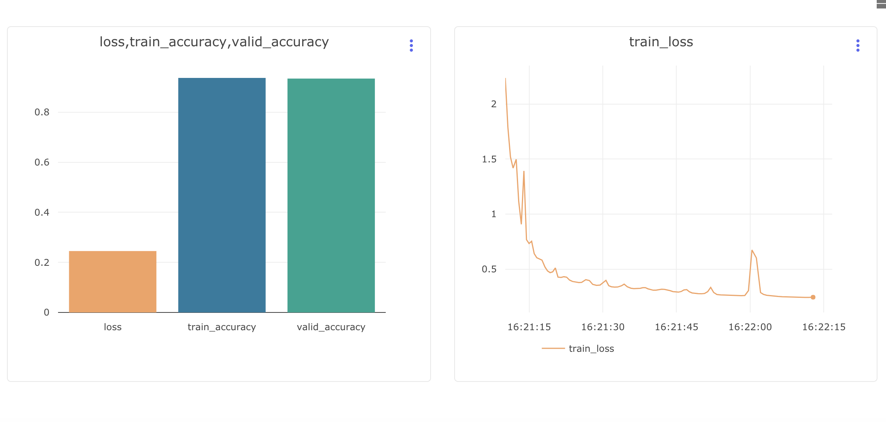

# Multi Layered Perceptron

# Setup
* Set up a `virtualenv`. To install `virtualenv:`
```
pip install virtualenv
```

Then create a virtualenv, maybe called `venv`
```
virtualenv venv
source venv/bin/activate
```

* Install requirements:
```
pip install -r requirements.txt
```

* Setup `PYTHONPATH` to contain `src/` and `dataset`.

* Run tests
`nosetests -v test/`

* To upload experiment results to `comet.ml`, 
* Create a `comet.ml` account.
* Export `COMET_API_KEY`, `COMET_WORKSPACE` and `COMET_PROJECT_NAME` variables and run `experiments.py`

# Sample Experiment

